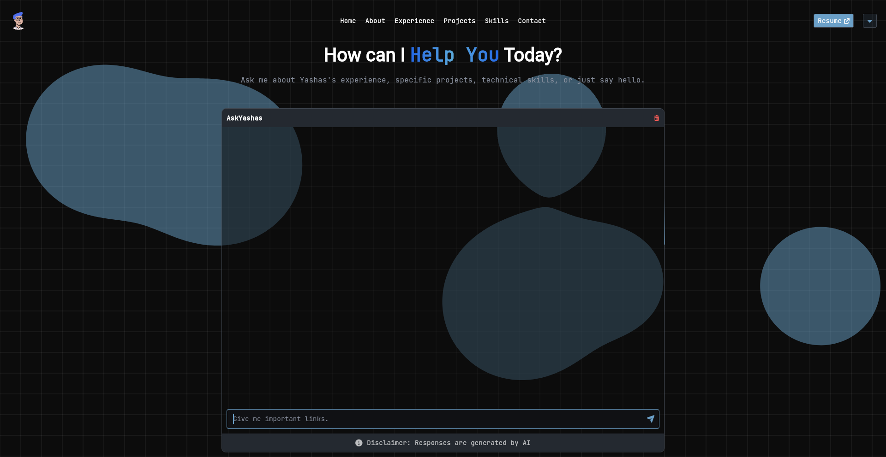
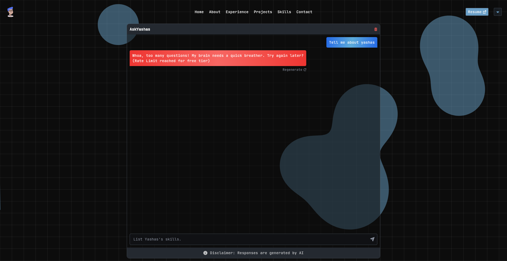
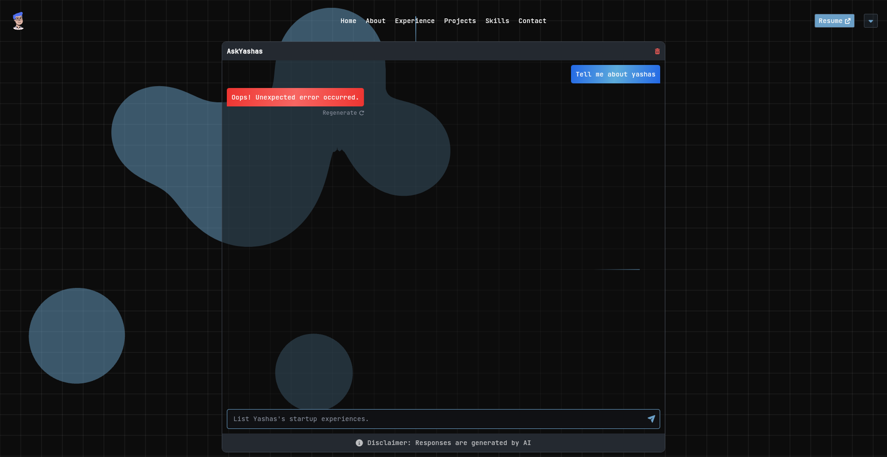

# AskYashas – Serverless RAG Chatbot

A personalized **Retrieval-Augmented Generation (RAG)** chatbot designed to answer questions about me (Yashas Majmudar)
with precision and context-awareness. It combines Google Gemini with Upstash Vector for semantic search, enabling
grounded, factual, and context-rich responses.

**Note:** You can use this repository as a template to create your own RAG ChatBot. Just make a few
changes – [follow these steps](#use-this-repo-as-template).

---

## Features

- **Serverless architecture** – Deploys to Vercel with minimal cold start
- **Hosted vector store** – Uses Upstash Vector (no local storage needed)
- **API-based embeddings** – Google's text-embedding-004 (no ML models to load)
- **RAG pipeline** – Retrieves relevant context before generating responses
- **Markdown responses** – Formatted for Flutter's `flutter_markdown` package
- **Origin-based security** – Restricts access to allowed domains
- **CI/CD pipeline** – GitHub Actions for automated vector updates

---

## Tech Stack

| Layer            | Tech                         |
|------------------|------------------------------|
| **Backend**      | FastAPI                      |
| **LLM**          | Google Gemini 2.0 Flash Lite |
| **Embeddings**   | Google text-embedding-004    |
| **Vector Store** | Upstash Vector (hosted)      |
| **CI/CD**        | GitHub Actions               |
| **Deployment**   | Vercel Serverless            |

---

## Architecture

```
User Query
    │
    ▼
┌─────────────────────────────────────────────────────┐
│              Vercel Serverless Function             │
├─────────────────────────────────────────────────────┤
│  1. Embed query (Google Embedding API)              │
│  2. Search similar docs (Upstash Vector)            │
│  3. Generate response (Google Gemini)               │
└─────────────────────────────────────────────────────┘
    │
    ▼
Markdown Response
```

---

## Project Structure

```
ask-yashas-llm/
├── api/
│   ├── endpoints/
│   │   ├── answer.py         # POST /api/prompt
│   │   ├── default.py        # GET / (redirect)
│   │   └── health_check.py   # GET /api/healthCheck
│   ├── model/
│   │   └── query_model.py    # Request/response models
│   └── utils/
│       ├── llm_pipeline.py   # RAG pipeline
│       ├── middleware.py     # Security middleware
│       ├── bypass_key_gen.py # Generate bypass keys
│       └── upload_vectorstore_data.py  # Upload to Upstash
├── app.py                    # FastAPI entry point
├── rag_data.json             # Structured data for RAG
├── requirements.txt
├── vercel.json               # Vercel config
└── .github/workflows/
    └── data_change_action.yml  # Auto-update vectors on data change
```

---

## Environment Variables

| Variable                    | Description                                   |
|-----------------------------|-----------------------------------------------|
| `API_TOKEN`                 | Google Gemini API key                         |
| `UPSTASH_VECTOR_REST_URL`   | Upstash Vector index URL                      |
| `UPSTASH_VECTOR_REST_TOKEN` | Upstash Vector access token                   |
| `BYPASS_KEY`                | (Optional) Secret key to bypass origin checks |

---

## API Endpoints

### `POST /api/prompt`

Send a question and get a response.

**Request:**

```json
{
  "query": "What are Yashas's skills?",
  "history": [
    {
      "role": "HUMAN",
      "message": "Hello"
    },
    {
      "role": "AI",
      "message": "Hi! How can I help you?"
    }
  ]
}
```

**Response:**

```json
{
  "response": "**Yashas Majmudar** has expertise in:\n\n- **Mobile**: Flutter, Android, iOS\n- **Backend**: FastAPI, Node.js\n- **AI/ML**: Python, LangChain, LLMs"
}
```

### `GET /api/healthCheck`

Returns health status.

### `GET /`

Redirects to https://yashashm.dev/chat

---

## Use This Repo as Template

### 1. Set up Upstash Vector

1. Create account at [console.upstash.com](https://console.upstash.com)
2. Create a Vector index:
    - **Dimensions**: 768
    - **Distance Metric**: Cosine
3. Copy `UPSTASH_VECTOR_REST_URL` and `UPSTASH_VECTOR_REST_TOKEN`

### 2. Get Google Gemini API Key

1. Go to [aistudio.google.com/apikey](https://aistudio.google.com/apikey)
2. Create an API key
3. Copy as `API_TOKEN`

### 3. Update Your Data

Edit `rag_data.json` with your information:

```json
{
  "about": {
    "name": "Your Name",
    "title": "Your Title",
    "summary": "Your bio..."
  },
  "skills": {
  },
  "experience": [
  ],
  "projects": [
  ]
}
```

### 4. Set Environment Variables

Create `.env` file:

```bash
API_TOKEN=your-gemini-api-key
UPSTASH_VECTOR_REST_URL=your-upstash-url
UPSTASH_VECTOR_REST_TOKEN=your-upstash-token
BYPASS_KEY=optional-bypass-key
```

### 5. Upload Data to Upstash

```bash
pip install -r requirements.txt
python api/utils/upload_vectorstore_data.py
```

### 6. Run Locally

```bash
uvicorn app:app --reload --port 3000
```

### 7. Test

```bash
curl -X POST "http://localhost:3000/api/prompt?bypass_key=your-key" \
  -H "Content-Type: application/json" \
  -d '{"query": "Who are you?", "history": []}'
```

### 8. Deploy to Vercel

```bash
npm i -g vercel
vercel
```

Add environment variables in Vercel dashboard.

### 9. Update Security

Edit `api/utils/middleware.py` to add your allowed origins:

```python
allowed_origin = [
    "https://yourdomain.com",
    "https://chat.yourdomain.com",
]
```

---

## CI/CD

The GitHub Action (`.github/workflows/data_change_action.yml`) automatically:

1. Triggers when `rag_data.json` is modified
2. Regenerates embeddings via Google API
3. Uploads new vectors to Upstash

Add these secrets to your GitHub repo:

- `API_TOKEN`
- `UPSTASH_VECTOR_REST_URL`
- `UPSTASH_VECTOR_REST_TOKEN`

---

## Preview




